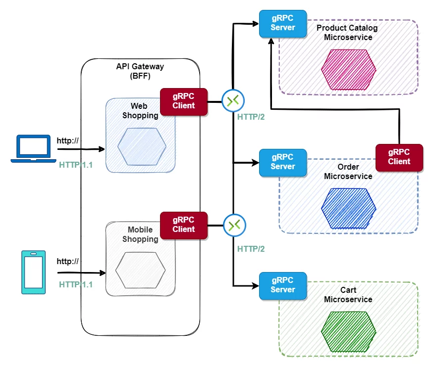

<div align="center">
<h1>FinS API Microservices</h1>
</div>

# Git Workflow

Mỗi thành viên khi nhận hoặc đảm nhiệm một tính năng để phát triển, vui lòng clone từ commit từ branch dev gần nhất và đặt tên branch của mình theo format như sau

`dev*{function}*{username hoặc name của người làm}`

Git commit vào mỗi cuối ngày để follow tiến độ.
Git commit tuân theo pattern sau:

`{ACTION}-{nội dung tính năng vắng tất (tối đa 50 ký tự)}`

Ví dụ: UPDATE - add component table campaign.

Sau khi hoàn tất thì tạo một pull request vào branch dev và báo lead review code.

# Microservices:

<div align="center">

</div>


# Architecture:

- DB: PostgreSQL
- Programing Language: Go (v1.20 or above)
- Design pattern: Repository Pattern
- Protocol: HTTP (API REST) + gRPC
- Cache: Redis, Mem Cache
- Queue Messages: RabbitMQ, Redis


# References

- Golang ORM: [Bun](https://bun.uptrace.dev/)
    - Link: https://bun.uptrace.dev
    - Git: https://github.com/uptrace/bun

- gRPC Gateway: 
    - Link: https://grpc-ecosystem.github.io/grpc-gateway
    - Git: https://github.com/grpc-ecosystem/grpc-gateway

- Protobuf:
    - Guide: https://protobuf.dev/programming-guides/proto3/
    - Buf: https://buf.build/

- Go Generics:
    - Link: https://go.dev/doc/tutorial/generics

- Protovalidate: 
    - https://github.com/bufbuild/protovalidate
    - https://github.com/bufbuild/protovalidate-go

# Setup Project

## Buf

### Install the Buf CLI
Cài đặt Buf CLI theo link sau: https://buf.build/docs/installation

### Tools

Setup một project Go bên ngoài để track version của một số packages.

```go
// +build tools

package tools

import (
    _ "github.com/grpc-ecosystem/grpc-gateway/v2/protoc-gen-grpc-gateway"
    _ "github.com/grpc-ecosystem/grpc-gateway/v2/protoc-gen-openapiv2"
    _ "google.golang.org/grpc/cmd/protoc-gen-go-grpc"
    _ "google.golang.org/protobuf/cmd/protoc-gen-go"
)
```

Chạy `go mod tidy` để bổ sung các packages, sau đó chạy lệnh sau:

```sh
$ go install \
    github.com/grpc-ecosystem/grpc-gateway/v2/protoc-gen-grpc-gateway \
    github.com/grpc-ecosystem/grpc-gateway/v2/protoc-gen-openapiv2 \
    google.golang.org/protobuf/cmd/protoc-gen-go \
    google.golang.org/grpc/cmd/protoc-gen-go-grpc
```

## Project structure:

- `common`: Chứa các bộ tiện ích dùng chung. Trong trường hợp xử lý logic cần có unit test để cover các trường hợp cũng như xem đây là docs hướng dẫn cho các thành viên.
- `server`: gRPC và REST được định nghĩa tại đây, nếu cần bồ sung các route thì bổ sung tại đây.
- `grpc`: Chứa các server grpc implement sau khi gen.
- `service`: Layer định nghĩa các logic.
- `repository`: Layer định nghĩa các phương thức giao tiếp tới DB.
- `gen`: Chứa các file proto được gen. (Hạn chế định nghĩa hay điều chỉnh tại đây do có thể bị override)
- `proto`: Định nghĩa các message, service protobuf, annotation.

### Luồng code:
- Định nghĩa các message, service protobuf, annotation xong dùng lệnh `buf generate` để gen.
- Implement tại `grpc`.
- Đưa các logic vào `service` và tương tác với db qua `repository`.

#### Lưu ý:
- Không cần định nghĩa các route REST, vì trong file proto đã định nghĩa, thư viện sẽ tự làm việc đó.
- Trong trường hợp các define một số case cụ thể (ví dụ như nhận file), bạn vui lòng tạo folder `api` + `v1` (version) và định nghĩa tại đây, sau đó cấu hình vào `server`.
- Validator được proto định nghĩa. [link](https://github.com/bufbuild/protovalidate)